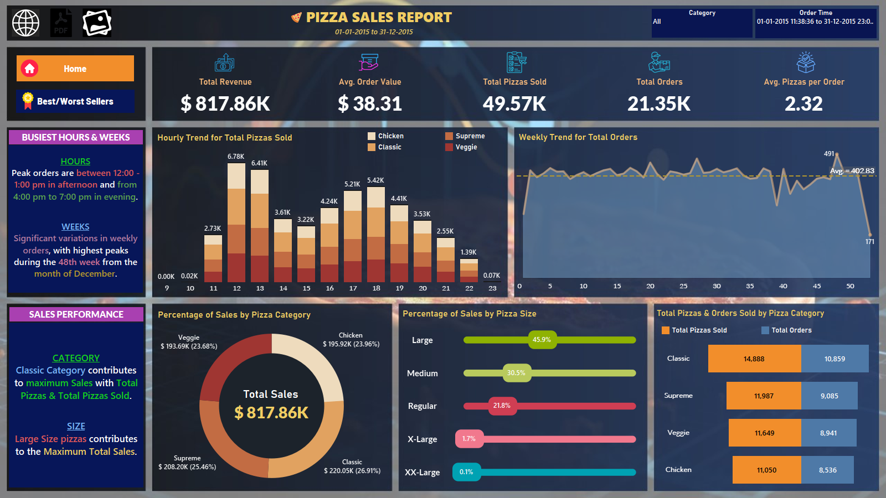

# Pizza Place Sales Dataset EDA

 

This repository contains code and analysis for exploring a fictitious pizza place's sales dataset, provided by [Maven Analytics](https://www.mavenanalytics.io/challenges/maven-pizza-challenge/4). The dataset includes information such as the date and time of each order, details on the pizzas served (type, size, quantity, price, ingredients), and more.

## Dataset Information

The dataset contains a year's worth of sales data from the pizza place. Key attributes include:

- Date and time of each order
- Type, size, quantity, price, and ingredients of pizzas sold

## Analysis Goals

The recommended analysis focuses on several key questions:

1. **Customer Traffic and Peak Hours:**
   - How many customers do we have each day?
   - Are there any peak hours or times when sales are particularly high?

2. **Order Composition and Bestsellers:**
   - How many pizzas are typically in an order?
   - Do we have any bestsellers in terms of pizza types, sizes, or combinations?

3. **Revenue and Seasonality:**
   - How much revenue did we generate this year?
   - Can we identify any seasonal trends or patterns in the sales data?

4. **Menu Optimization and Promotions:**
   - Are there any pizzas that should be removed from the menu due to low sales?
   - Are there any promotions or marketing strategies we could leverage based on the analysis?

## Repository Structure

The repository is structured as follows:

- **data_dictionary.csv:** Excel file containing the data dictionary with descriptions of each column in the dataset.
- **data_import.ipynb:** Jupyter Notebook for data importing, merging, and cleaning. This notebook prepares the data for analysis.
- **Pizza Sales Report.twbx:** Tableau Workbook for exploratory data analysis (EDA) of the pizza sales dataset. The workbook contains visualizations and insights derived from the data.
- **pizza_sales:** Folder containing the raw data files.
- **pizza_salesPandas.ipynb:** Jupyter Notebook for EDA using Pandas. This notebook performs in-depth analysis using Python's Pandas library, exploring trends, patterns, and insights in the data.
- **pizza_sales_data.csv:** Cleaned and processed data file ready for analysis.

## Usage

1. Clone or download the repository to your local machine.
2. Open and run `data_import.ipynb` to import, merge, and clean the data.
3. Open `Pizza Sales Report.twbx` using Tableau to explore visualizations and insights.
4. Explore the `pizza_salesPandas.ipynb` notebook for detailed analysis using Pandas.

## Additional Notes

- Ensure you have Tableau installed to view and interact with the Tableau workbook (`Pizza Sales Report.twbx`).
- The data dictionary (`data_dictionary.csv`) provides descriptions of each column in the dataset, aiding in understanding the data's structure and attributes.

Enjoy exploring the pizza place sales dataset and uncovering valuable insights!